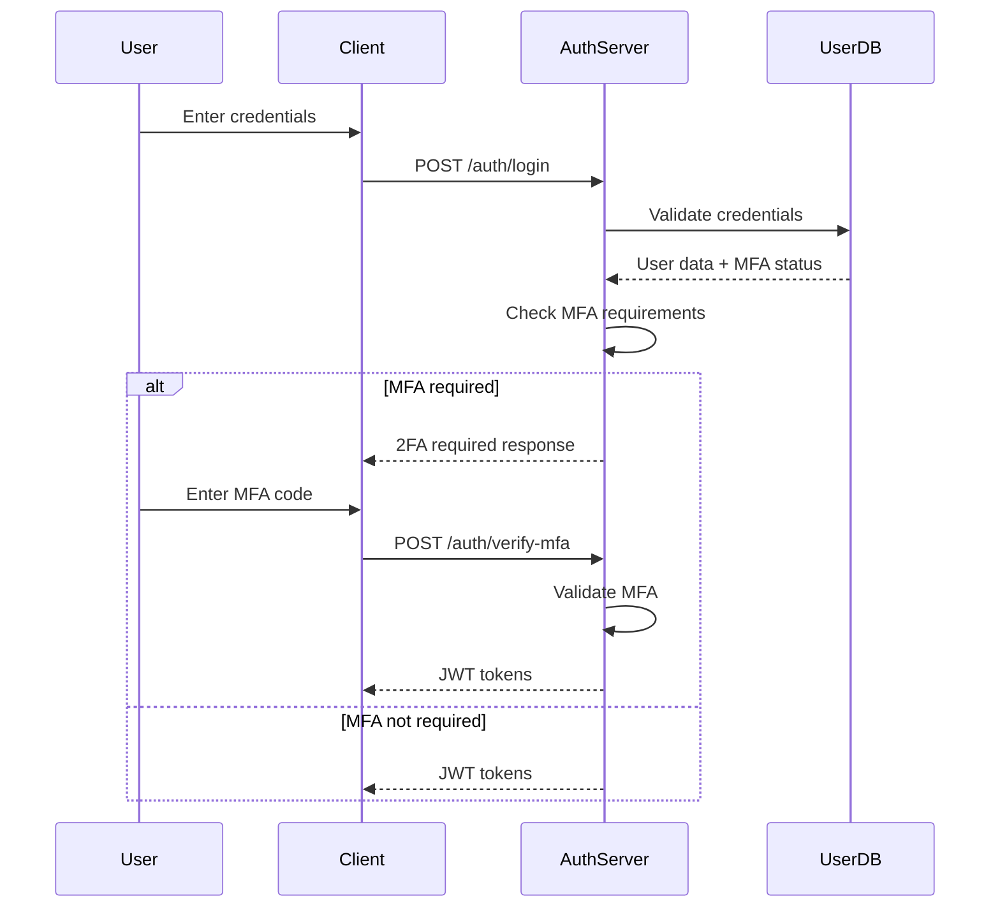
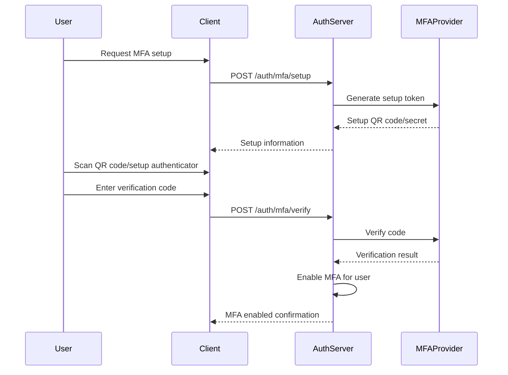

# Direct Organization Management System - Authentication and Authorization

**Document Version**: 1.0  
**Created**: February 2026  
**Last Updated**: February 2026  
**Status**: Draft

## Table of Contents

1. [Authentication and Authorization Overview](#authentication-and-authorization-overview)
2. [Authentication System](#authentication-system)
3. [Authorization Framework](#authorization-framework)
4. [Scoped Roles and Permissions](#scoped-roles-and-permissions)
5. [Token Management](#token-management)
6. [Security Considerations](#security-considerations)
7. [Implementation Details](#implementation-details)

## Authentication and Authorization Overview

The Direct Organization Management System implements a comprehensive authentication and authorization framework that supports both traditional role-based access control (RBAC) and advanced scoped permissions. The system ensures secure access to organizational resources while maintaining flexibility for complex permission scenarios.

### Key Features

- **Multi-Factor Authentication (MFA)**: Support for various MFA methods
- **JWT-based Authentication**: Stateless authentication with secure tokens
- **Role-Based Access Control (RBAC)**: Hierarchical role system with inheritance
- **Scoped Permissions**: Context-aware permissions limited to specific groups or organization units
- **Organization Isolation**: Complete separation of organizational data and access
- **Audit Trail**: Comprehensive logging of all authentication and authorization events

### Security Principles

- **Principle of Least Privilege**: Users receive only the minimum permissions necessary
- **Defense in Depth**: Multiple layers of security controls
- **Zero Trust Architecture**: Continuous verification and validation
- **Secure by Default**: Security features enabled by default

## Authentication System

### Authentication Methods

#### Primary Authentication: Email and Password

```typescript
interface LoginRequest {
  email: string;
  password: string;
  mfaToken?: string; // Optional for MFA-enabled accounts
}

interface LoginResponse {
  token: string;           // JWT access token
  refreshToken: string;    // Refresh token for token renewal
  expiresIn: number;       // Token expiration in seconds
  user: UserAuthInfo;      // User information with permissions
}
```

#### Multi-Factor Authentication (MFA)

The system supports multiple MFA methods:

1. **TOTP (Time-based One-Time Password)**: Google Authenticator, Authy, etc.
2. **SMS OTP**: SMS-based one-time codes
3. **Email OTP**: Email-based one-time codes
4. **Hardware Tokens**: FIDO2/WebAuthn compatible devices

```typescript
interface MFASetupRequest {
  method: 'totp' | 'sms' | 'email';
  phoneNumber?: string; // Required for SMS
  email?: string;       // Required for email method
}

interface MFAVerificationRequest {
  method: 'totp' | 'sms' | 'email';
  code: string;
  setupToken?: string; // Required for initial setup
}
```

### Authentication Flow

#### Standard Login Flow



#### MFA Setup Flow



### Password Security

#### Password Requirements

```typescript
interface PasswordPolicy {
  minLength: 12;
  requireUppercase: true;
  requireLowercase: true;
  requireNumbers: true;
  requireSpecialChars: true;
  preventCommonPasswords: true;
  preventUserInfoInPassword: true;
  historyCheck: 12; // Prevent reuse of last 12 passwords
}
```

#### Password Hashing

```typescript
class PasswordService {
  private readonly SALT_ROUNDS = 12;
  
  async hashPassword(password: string): Promise<string> {
    return bcrypt.hash(password, this.SALT_ROUNDS);
  }
  
  async verifyPassword(password: string, hash: string): Promise<boolean> {
    return bcrypt.compare(password, hash);
  }
  
  async validatePasswordStrength(password: string): Promise<PasswordValidationResult> {
    const result = new PasswordValidationResult();
    
    // Check length
    if (password.length < 12) {
      result.addError('Password must be at least 12 characters long');
    }
    
    // Check complexity
    const hasUpper = /[A-Z]/.test(password);
    const hasLower = /[a-z]/.test(password);
    const hasNumber = /[0-9]/.test(password);
    const hasSpecial = /[!@#$%^&*(),.?":{}|<>]/.test(password);
    
    if (!hasUpper) result.addError('Password must contain uppercase letters');
    if (!hasLower) result.addError('Password must contain lowercase letters');
    if (!hasNumber) result.addError('Password must contain numbers');
    if (!hasSpecial) result.addError('Password must contain special characters');
    
    // Check against common passwords
    if (await this.isCommonPassword(password)) {
      result.addError('Password is too common');
    }
    
    return result;
  }
}
```

## Authorization Framework

### Role-Based Access Control (RBAC)

The system implements a 7-tier role hierarchy with clear inheritance rules:

```typescript
enum SystemRole {
  SUPER_ADMIN = 'SUPER_ADMIN',     // All permissions
  ADMIN = 'ADMIN',                 // Organization-wide admin
  OU_OWNER = 'OU_OWNER',           // Organization unit owner
  OU_MANAGER = 'OU_MANAGER',       // Organization unit manager
  OU_MEMBER = 'OU_MEMBER',         // Organization unit member
  GROUP_OWNER = 'GROUP_OWNER',     // Group owner
  GROUP_MANAGER = 'GROUP_MANAGER', // Group manager
  GROUP_MEMBER = 'GROUP_MEMBER'    // Group member
}
```

### Permission System

#### Permission Categories

```typescript
enum PermissionCategory {
  USER_MANAGEMENT = 'user_management',
  ORGANIZATION_MANAGEMENT = 'organization_management',
  GROUP_MANAGEMENT = 'group_management',
  ROLE_MANAGEMENT = 'role_management',
  PERMISSION_MANAGEMENT = 'permission_management',
  AUDIT_MANAGEMENT = 'audit_management'
}
```

#### System Permissions

```typescript
const SYSTEM_PERMISSIONS = {
  // User Management
  VIEW_USERS: 'view_users',
  EDIT_USERS: 'edit_users',
  INVITE_USERS: 'invite_users',
  REMOVE_USERS: 'remove_users',
  MOVE_USERS: 'move_users',
  
  // Organization Management
  VIEW_ORGANIZATIONS: 'view_organizations',
  CREATE_ORGANIZATIONS: 'create_organizations',
  EDIT_ORGANIZATIONS: 'edit_organizations',
  DELETE_ORGANIZATIONS: 'delete_organizations',
  
  // Group Management
  VIEW_GROUPS: 'view_groups',
  CREATE_GROUPS: 'create_groups',
  EDIT_GROUPS: 'edit_groups',
  DELETE_GROUPS: 'delete_groups',
  MANAGE_GROUP_MEMBERS: 'manage_group_members',
  
  // Role Management
  VIEW_ROLES: 'view_roles',
  CREATE_ROLES: 'create_roles',
  EDIT_ROLES: 'edit_roles',
  DELETE_ROLES: 'delete_roles',
  ASSIGN_ROLES: 'assign_roles',
  
  // Permission Management
  VIEW_PERMISSIONS: 'view_permissions',
  CREATE_PERMISSIONS: 'create_permissions',
  EDIT_PERMISSIONS: 'edit_permissions',
  DELETE_PERMISSIONS: 'delete_permissions'
};
```

## Scoped Roles and Permissions

### Scope Types

The system supports three types of scoped roles:

1. **Organization-Level**: Applies to the entire organization
2. **Group-Scoped**: Limited to specific groups
3. **Organization Unit-Scoped**: Limited to specific organization units

```typescript
enum ScopeType {
  ORGANIZATION = 'organization',
  GROUP = 'group',
  ORGANIZATION_UNIT = 'organization_unit'
}

interface ScopedRole {
  id: UUID;
  name: string;
  description: string;
  scopeType: ScopeType;
  scopeId: UUID | null; // null for organization-level roles
  permissions: Permission[];
  organizationId: UUID;
}
```

### Scoped Role Examples

#### Group-Scoped Role: "Group Project Manager"

```typescript
const groupProjectManagerRole: ScopedRole = {
  id: 'role-group-pm-uuid',
  name: 'Group Project Manager',
  description: 'Can manage projects within their assigned group',
  scopeType: ScopeType.GROUP,
  scopeId: 'group-developers-uuid',
  permissions: [
    { name: 'create_projects', scope: 'group' },
    { name: 'edit_projects', scope: 'group' },
    { name: 'delete_projects', scope: 'group' },
    { name: 'assign_project_members', scope: 'group' }
  ],
  organizationId: 'org-uuid'
};
```

#### Organization Unit-Scoped Role: "Department Manager"

```typescript
const departmentManagerRole: ScopedRole = {
  id: 'role-dept-mgr-uuid',
  name: 'Department Manager',
  description: 'Can manage users and resources within their department',
  scopeType: ScopeType.ORGANIZATION_UNIT,
  scopeId: 'ou-engineering-uuid',
  permissions: [
    { name: 'view_department_users', scope: 'organization_unit' },
    { name: 'invite_department_users', scope: 'organization_unit' },
    { name: 'move_department_users', scope: 'organization_unit' },
    { name: 'manage_department_resources', scope: 'organization_unit' }
  ],
  organizationId: 'org-uuid'
};
```

### Permission Evaluation with Scopes

```typescript
class PermissionEvaluator {
  async evaluatePermission(
    userId: UUID, 
    permissionName: string, 
    context?: PermissionContext
  ): Promise<boolean> {
    const user = await this.getUser(userId);
    const userRoles = await this.getUserRoles(userId);
    
    for (const role of userRoles) {
      const hasPermission = this.checkRolePermission(role, permissionName);
      
      if (hasPermission) {
        // Check scope validity
        const scopeValid = await this.validateScope(role, context);
        
        if (scopeValid) {
          return true;
        }
      }
    }
    
    return false;
  }
  
  private async validateScope(
    role: Role, 
    context?: PermissionContext
  ): Promise<boolean> {
    if (role.scopeType === ScopeType.ORGANIZATION) {
      return true; // No scope restrictions
    }
    
    if (!context) {
      return false; // Scoped permissions require context
    }
    
    switch (role.scopeType) {
      case ScopeType.GROUP:
        return this.validateGroupScope(role, context);
        
      case ScopeType.ORGANIZATION_UNIT:
        return this.validateOrganizationUnitScope(role, context);
        
      default:
        return false;
    }
  }
  
  private async validateGroupScope(
    role: Role, 
    context: PermissionContext
  ): Promise<boolean> {
    if (!context.groupId) {
      return false;
    }
    
    // Check if the role's scope matches the context
    if (role.scopeId !== context.groupId) {
      return false;
    }
    
    // Check if user is still a member of the group
    const userGroups = await this.getUserGroups(context.userId);
    const isInGroup = userGroups.some(g => g.id === context.groupId);
    
    return isInGroup;
  }
  
  private async validateOrganizationUnitScope(
    role: Role, 
    context: PermissionContext
  ): Promise<boolean> {
    if (!context.organizationUnitId) {
      return false;
    }
    
    // Check if the role's scope matches the context
    if (role.scopeId !== context.organizationUnitId) {
      return false;
    }
    
    // Check if user still belongs to the organization unit
    const user = await this.getUser(context.userId);
    
    return user.organizationUnitId === context.organizationUnitId;
  }
}

interface PermissionContext {
  userId: UUID;
  groupId?: UUID;
  organizationUnitId?: UUID;
  targetResourceId?: UUID;
  action: string;
}
```

### Role Assignment with Scopes

```typescript
class RoleAssignmentService {
  async assignScopedRole(
    userId: UUID,
    roleId: UUID,
    assignedBy: UUID,
    context?: AssignmentContext
  ): Promise<UserRole> {
    const user = await this.getUser(userId);
    const role = await this.getRole(roleId);
    const assigner = await this.getUser(assignedBy);
    
    // 1. Validate organization isolation
    if (user.organizationId !== role.organizationId) {
      throw new ValidationError('User and role must belong to the same organization');
    }
    
    // 2. Validate assigner permissions
    await this.validateAssignmentPermissions(assigner, role, context);
    
    // 3. Validate scope-specific requirements
    await this.validateScopeRequirements(user, role, context);
    
    // 4. Create role assignment
    const userRole = new UserRole({
      userId,
      roleId,
      assignedBy,
      assignedAt: new Date(),
      status: 'active'
    });
    
    return await this.userRoleRepository.save(userRole);
  }
  
  private async validateAssignmentPermissions(
    assigner: User,
    role: Role,
    context?: AssignmentContext
  ): Promise<void> {
    // Check if assigner has permission to assign roles
    const assignerPermissions = await this.getUserPermissions(assigner.id);
    
    if (!assignerPermissions.includes('assign_roles')) {
      throw new AuthorizationError('Assigner does not have permission to assign roles');
    }
    
    // For scoped roles, check if assigner has appropriate scope permissions
    if (role.scopeType !== ScopeType.ORGANIZATION) {
      await this.validateScopePermissions(assigner, role, context);
    }
  }
  
  private async validateScopePermissions(
    assigner: User,
    role: Role,
    context?: AssignmentContext
  ): Promise<void> {
    switch (role.scopeType) {
      case ScopeType.GROUP:
        await this.validateGroupAssignmentPermissions(assigner, role, context);
        break;
        
      case ScopeType.ORGANIZATION_UNIT:
        await this.validateOrganizationUnitAssignmentPermissions(assigner, role, context);
        break;
        
      default:
        throw new ValidationError(`Invalid scope type: ${role.scopeType}`);
    }
  }
  
  private async validateGroupAssignmentPermissions(
    assigner: User,
    role: Role,
    context?: AssignmentContext
  ): Promise<void> {
    // Check if assigner is owner or manager of the group
    const groupMemberships = await this.getGroupMemberships(assigner.id, role.scopeId);
    const membership = groupMemberships.find(m => m.groupId === role.scopeId);
    
    if (!membership || (membership.roleInGroup !== 'owner' && membership.roleInGroup !== 'manager')) {
      throw new AuthorizationError('Assigner must be group owner or manager to assign group-scoped roles');
    }
    
    // Check if assigner has the role being assigned (for non-admin roles)
    const assignerRoles = await this.getUserRoles(assigner.id);
    const hasRole = assignerRoles.some(r => r.id === role.id || r.name === 'GROUP_OWNER');
    
    if (!hasRole && !this.hasAdminRole(assigner)) {
      throw new AuthorizationError('Assigner must have the role being assigned');
    }
  }
  
  private async validateOrganizationUnitAssignmentPermissions(
    assigner: User,
    role: Role,
    context?: AssignmentContext
  ): Promise<void> {
    // Check if assigner is owner or manager of the organization unit
    const assignerUnit = await this.getOrganizationUnit(assigner.organizationUnitId);
    
    if (assignerUnit.ownerId !== assigner.id && !this.hasAdminRole(assigner)) {
      throw new AuthorizationError('Assigner must be organization unit owner to assign unit-scoped roles');
    }
  }
  
  private async validateScopeRequirements(
    user: User,
    role: Role,
    context?: AssignmentContext
  ): Promise<void> {
    switch (role.scopeType) {
      case ScopeType.GROUP:
        await this.validateGroupScopeRequirements(user, role);
        break;
        
      case ScopeType.ORGANIZATION_UNIT:
        await this.validateOrganizationUnitScopeRequirements(user, role);
        break;
        
      case ScopeType.ORGANIZATION:
        // No additional requirements for organization-level roles
        break;
    }
  }
  
  private async validateGroupScopeRequirements(
    user: User,
    role: Role
  ): Promise<void> {
    // User must be a member of the group to receive group-scoped roles
    const userGroups = await this.getUserGroups(user.id);
    const isInGroup = userGroups.some(g => g.id === role.scopeId);
    
    if (!isInGroup) {
      throw new ValidationError('User must be a member of the group to receive this scoped role');
    }
  }
  
  private async validateOrganizationUnitScopeRequirements(
    user: User,
    role: Role
  ): Promise<void> {
    // User must belong to the organization unit to receive unit-scoped roles
    if (user.organizationUnitId !== role.scopeId) {
      throw new ValidationError('User must belong to the organization unit to receive this scoped role');
    }
  }
}

interface AssignmentContext {
  groupId?: UUID;
  organizationUnitId?: UUID;
  reason?: string;
}
```

## Token Management

### JWT Token Structure

```typescript
interface AuthTokenPayload {
  userId: UUID;
  organizationId: UUID;
  roles: UserRoleInfo[];
  permissions: string[];
  scopePermissions: ScopedPermissionInfo[];
  exp: number; // Expiration timestamp
  iat: number; // Issued at timestamp
  jti: string; // JWT ID for revocation
}

interface UserRoleInfo {
  roleId: UUID;
  roleName: string;
  scopeType: ScopeType;
  scopeId: UUID | null;
  assignedAt: Date;
}

interface ScopedPermissionInfo {
  permissionName: string;
  scopeType: ScopeType;
  scopeId: UUID | null;
  grantedAt: Date;
}
```

### Token Generation

```typescript
class TokenService {
  private readonly ACCESS_TOKEN_EXPIRY = 3600; // 1 hour
  private readonly REFRESH_TOKEN_EXPIRY = 86400 * 7; // 7 days
  
  async generateTokens(userId: UUID): Promise<TokenPair> {
    const user = await this.getUser(userId);
    const permissions = await this.getUserPermissions(userId);
    const scopedPermissions = await this.getUserScopedPermissions(userId);
    
    const payload: AuthTokenPayload = {
      userId: user.id,
      organizationId: user.organizationId,
      roles: await this.getUserRoleInfo(userId),
      permissions: permissions.map(p => p.name),
      scopePermissions: scopedPermissions,
      exp: Math.floor(Date.now() / 1000) + this.ACCESS_TOKEN_EXPIRY,
      iat: Math.floor(Date.now() / 1000),
      jti: uuid()
    };
    
    const accessToken = jwt.sign(payload, process.env.JWT_SECRET, {
      algorithm: 'HS256',
      expiresIn: this.ACCESS_TOKEN_EXPIRY
    });
    
    const refreshToken = await this.generateRefreshToken(userId);
    
    return {
      accessToken,
      refreshToken,
      expiresIn: this.ACCESS_TOKEN_EXPIRY
    };
  }
  
  async refreshTokens(refreshToken: string): Promise<TokenPair> {
    const tokenData = await this.validateRefreshToken(refreshToken);
    
    if (!tokenData) {
      throw new AuthenticationError('Invalid refresh token');
    }
    
    return await this.generateTokens(tokenData.userId);
  }
  
  private async generateRefreshToken(userId: UUID): Promise<string> {
    const token = uuid();
    const expiry = new Date(Date.now() + this.REFRESH_TOKEN_EXPIRY * 1000);
    
    await this.refreshTokenRepository.create({
      token,
      userId,
      expiresAt: expiry,
      createdAt: new Date()
    });
    
    return token;
  }
}
```

### Token Validation

```typescript
class TokenValidator {
  async validateAccessToken(token: string): Promise<AuthTokenPayload> {
    try {
      const payload = jwt.verify(token, process.env.JWT_SECRET) as AuthTokenPayload;
      
      // Check if token is revoked
      const isRevoked = await this.isTokenRevoked(payload.jti);
      
      if (isRevoked) {
        throw new AuthenticationError('Token has been revoked');
      }
      
      return payload;
    } catch (error) {
      if (error instanceof jwt.JsonWebTokenError) {
        throw new AuthenticationError('Invalid token');
      }
      if (error instanceof jwt.TokenExpiredError) {
        throw new AuthenticationError('Token has expired');
      }
      
      throw error;
    }
  }
  
  async validateRefreshToken(token: string): Promise<RefreshTokenData> {
    const tokenData = await this.refreshTokenRepository.findByToken(token);
    
    if (!tokenData) {
      throw new AuthenticationError('Invalid refresh token');
    }
    
    if (tokenData.expiresAt < new Date()) {
      await this.refreshTokenRepository.delete(tokenData.id);
      throw new AuthenticationError('Refresh token has expired');
    }
    
    return {
      userId: tokenData.userId,
      tokenId: tokenData.id
    };
  }
  
  async revokeToken(tokenId: string): Promise<void> {
    await this.revokedTokenRepository.create({
      tokenId,
      revokedAt: new Date()
    });
  }
  
  private async isTokenRevoked(tokenId: string): Promise<boolean> {
    const revokedToken = await this.revokedTokenRepository.findByTokenId(tokenId);
    return !!revokedToken;
  }
}
```

## Security Considerations

### Security Headers

```typescript
const securityHeaders = {
  'X-Content-Type-Options': 'nosniff',
  'X-Frame-Options': 'DENY',
  'X-XSS-Protection': '1; mode=block',
  'Strict-Transport-Security': 'max-age=31536000; includeSubDomains',
  'Content-Security-Policy': "default-src 'self'",
  'Referrer-Policy': 'strict-origin-when-cross-origin'
};
```

### Rate Limiting

```typescript
class RateLimiter {
  private readonly redis: Redis;
  
  async checkRateLimit(identifier: string, limit: number, window: number): Promise<RateLimitResult> {
    const key = `rate_limit:${identifier}`;
    const now = Date.now();
    
    // Remove expired entries
    await this.redis.zremrangebyscore(key, 0, now - window);
    
    // Count current requests
    const currentRequests = await this.redis.zcard(key);
    
    if (currentRequests >= limit) {
      const oldestRequest = await this.redis.zrange(key, 0, 0, 'WITHSCORES');
      const resetTime = parseInt(oldestRequest[1]) + window;
      
      return {
        allowed: false,
        remaining: 0,
        resetTime: resetTime
      };
    }
    
    // Add current request
    await this.redis.zadd(key, now, `${now}-${Math.random()}`);
    await this.redis.expire(key, Math.ceil(window / 1000));
    
    return {
      allowed: true,
      remaining: limit - currentRequests - 1,
      resetTime: now + window
    };
  }
}
```

### Account Lockout

```typescript
class AccountLockoutService {
  private readonly MAX_FAILED_ATTEMPTS = 5;
  private readonly LOCKOUT_DURATION = 15 * 60 * 1000; // 15 minutes
  
  async handleFailedLogin(userId: UUID): Promise<void> {
    const lockoutKey = `lockout:${userId}`;
    const attemptsKey = `attempts:${userId}`;
    
    const attempts = await this.redis.incr(attemptsKey);
    await this.redis.expire(attemptsKey, 900); // 15 minutes
    
    if (attempts >= this.MAX_FAILED_ATTEMPTS) {
      await this.redis.setex(lockoutKey, this.LOCKOUT_DURATION / 1000, 'locked');
      await this.auditService.logSecurityEvent(userId, 'ACCOUNT_LOCKED', {
        reason: 'Too many failed login attempts',
        attempts
      });
    }
  }
  
  async isAccountLocked(userId: UUID): Promise<boolean> {
    const lockoutKey = `lockout:${userId}`;
    const isLocked = await this.redis.get(lockoutKey);
    return !!isLocked;
  }
  
  async resetFailedAttempts(userId: UUID): Promise<void> {
    const attemptsKey = `attempts:${userId}`;
    await this.redis.del(attemptsKey);
  }
}
```

## Implementation Details

### Database Schema for Authentication

```sql
-- Users table (already defined in database schema)
-- Additional tables for authentication

CREATE TABLE refresh_tokens (
    id UUID PRIMARY KEY DEFAULT gen_random_uuid(),
    user_id UUID NOT NULL REFERENCES users(id) ON DELETE CASCADE,
    token VARCHAR(255) NOT NULL UNIQUE,
    expires_at TIMESTAMP WITH TIME ZONE NOT NULL,
    created_at TIMESTAMP WITH TIME ZONE DEFAULT CURRENT_TIMESTAMP,
    revoked_at TIMESTAMP WITH TIME ZONE,
    
    CONSTRAINT uk_refresh_token UNIQUE (token)
);

CREATE TABLE revoked_tokens (
    id UUID PRIMARY KEY DEFAULT gen_random_uuid(),
    token_id VARCHAR(255) NOT NULL,
    revoked_at TIMESTAMP WITH TIME ZONE DEFAULT CURRENT_TIMESTAMP,
    
    CONSTRAINT uk_revoked_token UNIQUE (token_id)
);

CREATE TABLE mfa_devices (
    id UUID PRIMARY KEY DEFAULT gen_random_uuid(),
    user_id UUID NOT NULL REFERENCES users(id) ON DELETE CASCADE,
    device_type VARCHAR(20) NOT NULL CHECK (device_type IN ('totp', 'sms', 'email')),
    device_data JSONB NOT NULL,
    is_active BOOLEAN NOT NULL DEFAULT true,
    created_at TIMESTAMP WITH TIME ZONE DEFAULT CURRENT_TIMESTAMP,
    last_used_at TIMESTAMP WITH TIME ZONE,
    
    CONSTRAINT uk_user_device_type UNIQUE (user_id, device_type)
);

CREATE TABLE password_history (
    id UUID PRIMARY KEY DEFAULT gen_random_uuid(),
    user_id UUID NOT NULL REFERENCES users(id) ON DELETE CASCADE,
    password_hash VARCHAR(255) NOT NULL,
    created_at TIMESTAMP WITH TIME ZONE DEFAULT CURRENT_TIMESTAMP
);
```

### Middleware Implementation

```typescript
class AuthMiddleware {
  async authenticate(req: Request, res: Response, next: NextFunction): Promise<void> {
    const authHeader = req.headers.authorization;
    
    if (!authHeader || !authHeader.startsWith('Bearer ')) {
      return res.status(401).json({
        error: {
          code: 'MISSING_TOKEN',
          message: 'Authentication token is required'
        }
      });
    }
    
    const token = authHeader.substring(7);
    
    try {
      const payload = await this.tokenValidator.validateAccessToken(token);
      req.user = await this.enrichUserWithPermissions(payload);
      next();
    } catch (error) {
      return res.status(401).json({
        error: {
          code: 'INVALID_TOKEN',
          message: error.message
        }
      });
    }
  }
  
  async authorize(requiredPermissions: string[]): RequestHandler {
    return async (req: Request, res: Response, next: NextFunction) => {
      if (!req.user) {
        return res.status(401).json({
          error: {
            code: 'NOT_AUTHENTICATED',
            message: 'User not authenticated'
          }
        });
      }
      
      const hasPermissions = await this.permissionService.hasAllPermissions(
        req.user.id,
        requiredPermissions,
        req.context
      );
      
      if (!hasPermissions) {
        return res.status(403).json({
          error: {
            code: 'INSUFFICIENT_PERMISSIONS',
            message: 'Insufficient permissions for this operation'
          }
        });
      }
      
      next();
    };
  }
}
```

This comprehensive authentication and authorization framework provides robust security while supporting the complex scoped role requirements you mentioned. The system ensures that users can only access resources within their authorized scopes, with proper validation at every level.